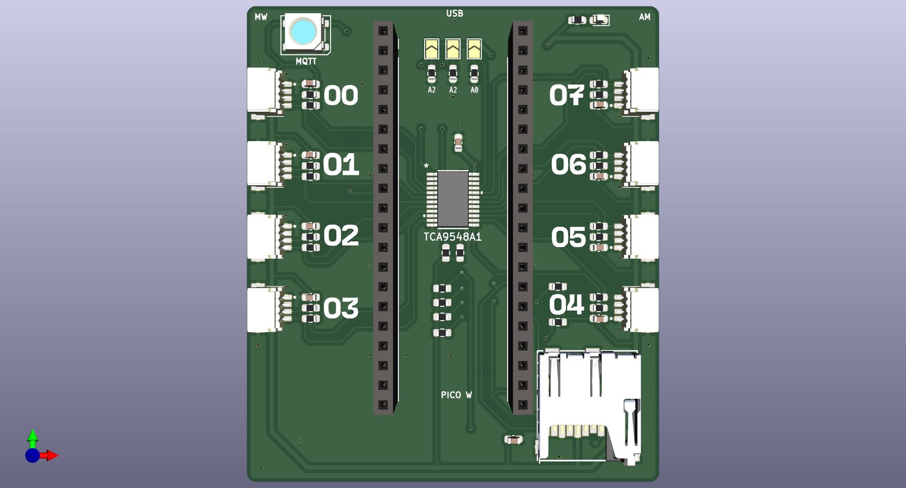
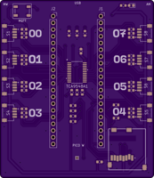
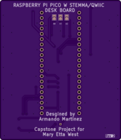

# Raspberry Pi Pico W STEMMA QT HAT
 KiCAD files for the Raspberry Pi Pico W STEMMA QT HAT for Capstone Project ?!

## OshPark Order Info for Rev 2 
https://docs.google.com/document/d/1SqxGY5_0k2WKVRfSDS7eGBg4YIIRN691AxTP8Kc-8wA/edit?usp=sharing

## Changes in Rev 2
The main change is adding the missing pull-up resistors needed for the tca9548a. Some other QoL changes were also made, such as changing the Neopixel footprint to match the ones we already have in the engineering room, add the ability to connect multiple of these boards by soldering jumper, changing the address. Also made the SD card traces cleaner for OCD reasons. The main purpose of this revision was to add the neccerary pull-up resistors and make sure to allow the access of all the pins in a open spot, even if I don't plan to use them.

## 3D models of Parts
In order to see the parts on the board when viewing the board in '3D viewer', you will need to adjust the file path in each of the footprints for PC by going to 'Footprint Properties' and then to '3D Models tab' and then adjust the path with 'Configure Paths'

## OshPark Front and Back View

